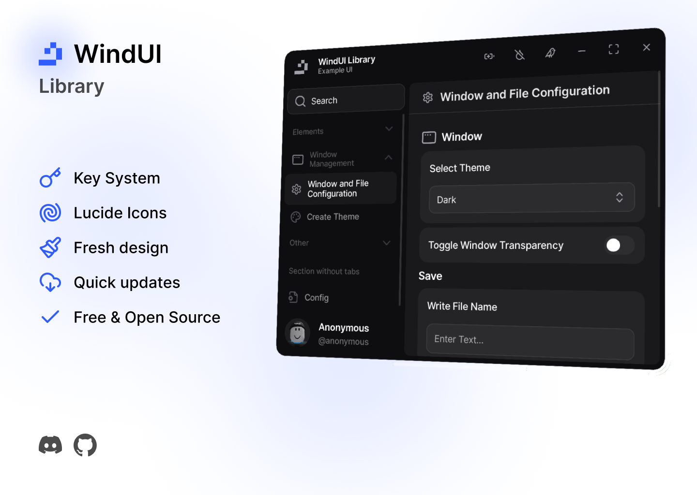

<!--<h1 align="center">WindUI</h1> -->

<picture>
    <source srcset="docs/banner-dark.webp" media="(prefers-color-scheme: dark)">
    <source srcset="docs/banner-light.webp" media="(prefers-color-scheme: light)">
    
</picture>

> [!WARNING]
> This WindUI was not inspired by, and the name has nothing to do with UI Frameworks

### Credits
- [Dawid-Scripts](https://github.com/dawid-scripts) (Colorpicker)
- [Lucide-Icons](https://github.com/lucide-icons/lucide) (Icons)

### Links
- [Discord Server](https://discord.gg/Q6HkNG4vwP)
- [Documentation](https://Footagesus.github.io/WindUI-Docs/)