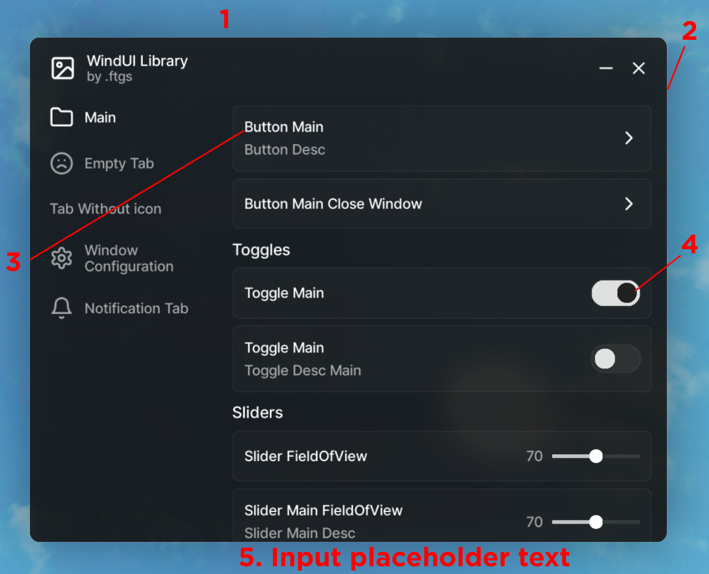

### WindUI 


### Credits:
- Dawid 


### Discord: https://discord.gg/VGws6ms6

## How to change it?
1. Clone repo
```bash
git clone https://github.com/Footagesus/WindUI.git
```

2. Edit
3. Run `npm run build`

For client run `npm run dev`

### ⚠️ Full example you can find in Example.lua


## Using UI Library

1. Connect UI Library
```lua
local Version = "1.0.0"
local WindUI = loadstring(game:HttpGetAsync("https://github.com/Footagesus/WindUI/releases/download/" .. Version .. "/main.lua"))()
```

2. Creating Window
```lua
local Window = WindUI:CreateWindow({
    Title = "WindUI Library",         -- UI Title                     
    Icon = "image",                   -- Url or rbxassetid or lucide  
    Author = ".ftgs",                 -- Author & Creator             
    Size = UDim2.fromOffset(580,460), -- UI Size                      
    Transparent = true,               -- UI Transparency              
    Theme = "Dark",                   -- UI Theme (Dark, Light, Lime) 
    SideBarWidth = 170,               -- UI Sidebar Width             
})
```

| Key          | Type    | Default                           |
|--------------|---------|-----------------------------------|
| Title        | string  | "UI Library"                      |
| Icon         | string  | nil                               |
| Author       | string  | nil                               |
| Size         | UDim2   | UDim2.fromOffset(560,460)         |
| Transparent  | boolean | false                             |
| Theme        | string  | "Dark"                            |
| SideBarWidth | number  | 200                               |


3. Creating Tab
```lua
local MainTab = Window:Tab({
    Title = "Main",  -- Tab Title                    
    Icon = "folder", -- Lucide Icons (src/Icons.lua)
})
```

| Key   | Type   | Default |
|-------|--------|---------|
| Title | string | "Tab"   |
| Icon  | string | nil     |


### Elements

- Creating Section
```lua
MainTab:Section({ 
    Title = "Title" -- Section Title
})
```

| Key   | Type   | Default   |
|-------|--------|-----------|
| Title | string | "Section" |


- Creating Button
```lua
local Button = MainTab:Button({
    Title = "Button Main",        -- Button Title       
    Desc = "Button Desc",         -- Button Description 
    Callback = function()         -- Button Callback    
        print("Callback Example")
    end,
})
```

| Key      | Type     | Default                |
|----------|----------|------------------------|
| Title    | string   | "Button"               |
| Desc     | string   | nil                    |
| Callback | function | function() end         |


- Creating Paragraph
```lua
local Paragraph = MainTab:Paragraph({
    Title = "Paragraph",                         -- Paragraph Title       
    Desc = "Paragraph Content\nAnd second line", -- Paragraph Description 
})
```

| Key   | Type   | Default     |
|-------|--------|-------------|
| Title | string | "Paragraph" |
| Desc  | string | nil         |


- Creating Toggle
```lua
local Button = MainTab:Toggle({
    Title = "Toggle",            -- Toggle Title
    Title = "Toggle Desc",       -- Toggle Description
    Callback = function(state)   -- Toggle Callback
        if state then
            print("True State")
        else
            print("False State")
        end
    end,
})
```

| Key      | Type     | Default                |
|----------|----------|------------------------|
| Title    | string   | "Toggle"               |
| Desc     | string   | nil                    |
| Callback | function | function() end         |


- Creating Slider
```lua
local Slider = MainTab:Slider({
    Title = "Slider FieldOfView", -- Slider Title
    Desc = "Slider Desc"          -- Slider Description
    Step = 10,                    -- Slider Stepping
    Value = {                     
        Min = 20,                 -- Min Slider value
        Max = 120,                -- Max Slider value
        Default = 70,             -- Default Slider value
    },
    Callback = function(value)    -- Slider Callback
        game.Workspace.Camera.FieldOfView = value
    end
})
```

| Key      | Type     | Default             |
|----------|----------|---------------------|
| Title    | string   | "Slider"            |
| Desc     | string   | nil                 |
| Step     | number   | 1                   |
| Value    | table    | {}                  |
| Callback | function | function(value) end |


- Creating Keybind
```lua
local Keybind = MainTab:Keybind({
    Title = "Keybind Toggle UI",     -- Keybind Title
    Desc = "Keybind Toggle UI Desc", -- Keybind Description
    Value = "LeftShift",             -- Keybind Value
    CanChange = true,                -- Can Change Keybind
    Callback = function(k)           -- Keybind Callback
        -- Toggle logic
    end
})
```

| Key      | Type    | Default                           |
|----------|---------|-----------------------------------|
| Title    | string  | "Keybind"                        |
| Desc     | string  | nil                               |
| Value    | string  | "LeftShift"                      |
| CanChange| boolean | true                              |
| Callback | function | function(key) end                |


- Creating Input
```lua
local Input = MainTab:Input({
    Title = "Input Notify",                      -- Input Title
    Desc = "Input Notify Desc",                  -- Input Description
    Value = "Text Hello",                        -- Default Input Value
    PlaceholderText = "Enter your message ahhh", -- Placeholder Text
    ClearTextOnFocus = true,                     -- Clear text on focus
    Callback = function(Text)                    -- Input Callback
        WindUI:Notify({             -- !!!! Example
            Title = "Input message",
            Content = "Message: " .. Text,
            Duration = 5,
        })
    end
})
```

| Key                | Type     | Default                       |
|--------------------|----------|-------------------------------|
| Title              | string   | "Input"                       |
| Desc               | string   | nil                           |
| Value              | string   | ""                            |
| PlaceholderText    | string   | ""                            |
| ClearTextOnFocus   | boolean  | false                         |
| Callback           | function | function() end                |


- Creating Dropdown
```lua
local Dropdown = MainTab:Dropdown({
    Title = "Dropdown",               -- Dropdown Title
    Desc = "Dropdown Desc",           -- Dropdown Description
    Multi = false,                    -- Allow multiple selections
    Value = "Tab 1",                  -- Default selected value
    AllowNone = true,                 -- Allow no selection
    Values = {                        -- List of options
        "Tab 1", "Tab 2", "Tab 3", "Tab 4", 
        "Tab 5", "Tab 6", "Tab 7", "Tab 8", 
        "Tab 9", "Tab 10", "Tab 11", 
        "Tab 12", "Tab 13", "Tab 14", 
        "Tab 15", "Tab 16", "Tab 17", 
        "Tab 18", "Tab 19", "Tab 20"
    },
    Callback = function(Tab)          -- Dropdown Callback
        WindUI:Notify({
            Title = "Dropdown Select",
            Content = "Selected: " .. Tab,
            Duration = 2,
        })
    end
})
```

| Key      | Type     | Default                |
|----------|----------|------------------------|
| Title    | string   | "Dropdown"             |
| Desc     | string   | nil                    |
| Multi    | boolean  | false                  |
| Value    | string   | ""                     |
| AllowNone| boolean  | false                  |
| Values   | table    | {}                     |
| Callback | function | function(Tab) end      |


### Other:

- Notify
```lua
WindUI:Notify({
    Title = "Notify Title",     -- Notification Title
    Content = "Notify Content", -- Notification Content
    Duration = 5,               -- Notification Duration
})
```

- Load Own Theme
```lua
Window:AddTheme({
    Name = "Example",           -- Theme Name
    
    Accent = "#1c1c1c",         -- Background       (1)
    Outline = "#0055ff",        -- Outline          (2)
    
    Text = "#FFFFFF",           -- Text             (3)
    Text2 = "#000000",          -- Text 2           (4)
    PlaceholderText = "#999999" -- Placeholder Text (5)
})
```



- Use Theme
```lua
Window:SetTheme("Dark") -- Theme
```

- Get Themes
```lua
Window:GetThemes()
```