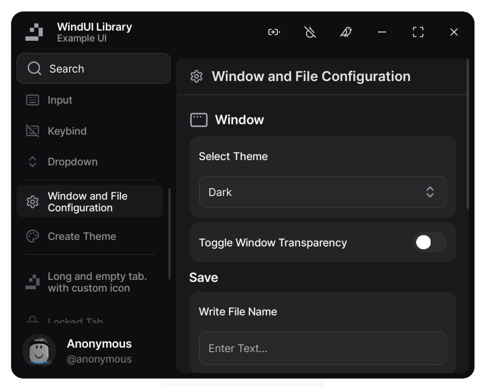

# WindUI 



[](https://github.com/Footagesus/WindUI/releases)
[](LICENSE)

An Open source and customizable UI library for Roblox, featuring a dark theme and flexible color options to create visually engaging interfaces for your script hub.

<hr>

## 🌟 Features

- 🌑 **Dark Theme**: Sleek, modern dark theme design.
- 🎨 **Customizable Colors**: Easily adjustable color settings for a personalized look.
- ⚙️ **Efficient Scripting**: Uses loadstring for optimized script execution.
- 🖊️ **Lucide Icons**: Uses suitable lucide icons that make the interface more beautiful

<hr>

### Credits:
- [Dawid-Scripts](https://github.com/dawid-scripts) (Colorpicker)
- [Lucide-Icons](https://github.com/lucide-icons/lucide) (Icons)


### [Discord Server](https://discord.gg/ctYGD2xB3r)

🚀 Installation

1. Clone the repository:
```bash
git clone https://github.com/Footagesus/WindUI.git
cd WindUI
```
2. Install dependencies if required.

3. Run `npm run build`

[Usage Documentation](https://tree-hub.vercel.app/docs/WindUI)

<hr>

> [!NOTE]
> Last icons update: December 8 2024